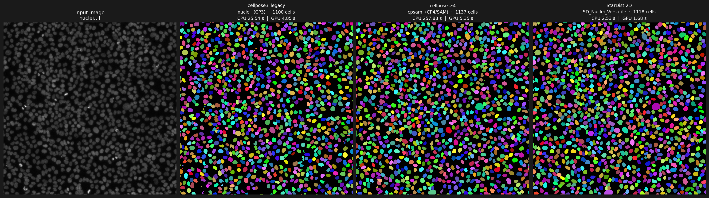

# cellpose3_legacy

> **A renamed legacy fork of the Cellpose CP3 branch, intended to coexist with Cellpose 4 / Cellpose-SAM (and cistardist_pytorch) in the same Python environment.**

Original upstream: [MouseLand/cellpose](https://github.com/MouseLand/cellpose)

---

## Installation

### From GitHub (recommended)

```bash
pip install --no-cache-dir \
    "git+https://github.com/Cellular-Imaging-Amsterdam-UMC/cellpose3_legacy@cp3"
```

### In a local virtual environment

```bash
# Create and activate a new environment
python -m venv .venv

# Windows
.venv\Scripts\activate
# Mac / Linux
source .venv/bin/activate

# Install
pip install --no-cache-dir \
    "git+https://github.com/Cellular-Imaging-Amsterdam-UMC/cellpose3_legacy@cp3"
```

### With conda

```bash
conda create -n cellpose3_legacy python=3.11
conda activate cellpose3_legacy
pip install --no-cache-dir \
    "git+https://github.com/Cellular-Imaging-Amsterdam-UMC/cellpose3_legacy@cp3"
```

### From a local clone (editable)

```bash
git clone https://github.com/Cellular-Imaging-Amsterdam-UMC/cellpose3_legacy.git
cd cellpose3_legacy
pip install -e .
```

### Coexistence with Cellpose >= 4

To use both Cellpose <=3 and Cellpose >=4 side by side:

```bash
pip install cellpose          # installs cellpose 4 / cellpose-SAM
pip install --no-cache-dir \
    "git+https://github.com/Cellular-Imaging-Amsterdam-UMC/cellpose3_legacy@cp3"
```

```python
import cellpose               # cellpose 4 / SAM
import cellpose3_legacy       # cellpose 3 (this fork)

from cellpose3_legacy import models, io
```

---

## Coexistence tests

Ready-to-run tests in `tests/` validate CP3, CP4/SAM, and StarDist in a single PyTorch environment:

| Test file | Algorithms |
|---|---|
| [`tests/test_coexistence.py`](tests/test_coexistence.py) | cellpose3_legacy (CP3) vs cellpose >=4 (CP4/SAM) |
| [`tests/test_coexistence_cp3_sd.py`](tests/test_coexistence_cp3_sd.py) | CP3 · CP3 fast mode · StarDist 2D — no CP4 import |
| [`tests/test_coexistence_cp3_cp4_sd.py`](tests/test_coexistence_cp3_cp4_sd.py) | CP3 · CP3 fast mode · CP4/SAM · StarDist 2D — with CPU & GPU timing and label montage |
| [`tests/profile_cp3_stardist_speed.py`](tests/profile_cp3_stardist_speed.py) | Stage-by-stage CP3/StarDist profiling plus CP3-fast-vs-default object metrics |

The three-algorithm test uses [cistardist-pytorch](https://pypi.org/project/cistardist-pytorch/)
([GitHub](https://github.com/Cellular-Imaging-Amsterdam-UMC/cistardist_pytorch)),
a PyTorch-only StarDist 2D implementation with no TensorFlow/Keras dependency.

```bash
pip install cistardist-pytorch
pytest tests/test_coexistence_cp3_sd.py -v
pytest tests/test_coexistence_cp3_cp4_sd.py -v
```

The test runs each algorithm on CPU and GPU, prints a timing table, and saves a
coloured label montage to `tests/output/montage_cp3_cp4_sd.png`.



```
Algorithm             Model                      Cells   CPU (s)   GPU (s)
----------------------------------------------------------------------------
cellpose3_legacy      nuclei  (CP3)               1100     25.54      4.85
cellpose >=4          cpsam  (CP4/SAM)            1137    257.88      5.35
StarDist 2D           SD_Nuclei_Versatile         1118      2.53      1.68
```

---

## CP3 fast mode

`CellposeModel.eval(..., fast_mode=True)` enables a tuned 2D inference preset
for CP3 nuclei-style segmentation. It is designed to be nearly identical to the
default CP3 output while avoiding the slowest full-resolution dynamics path.

Current fast-mode defaults:

```python
from cellpose3_legacy import models

model = models.CellposeModel(gpu=True, pretrained_model="nuclei")
masks, flows, styles = model.eval(
    image,
    channels=[0, 0],
    fast_mode=True,
    fast_diameter=17.0,      # optional; useful for nuclei benchmark images
)
```

Fast mode uses the same built-in CP3 nuclei model as default CP3 inference:

```python
model = models.CellposeModel(gpu=True, pretrained_model="nuclei")
```

Internally this uses:

| Setting | Fast-mode value |
|---|---:|
| `resample` | `False` |
| `fast_niter` / `niter` | `100` |
| `fast_interp` / `interp` | `True` |
| `fast_flow_threshold` / `flow_threshold` | `0.4` |

For maximum speed with less default-like output, pass `fast_flow_threshold=0`
to skip the flow-QC pass.

On `tests/data/nuclei_large.tif` with an NVIDIA RTX A5000 in the `sdcpsam`
environment, CP3 and CP3 fast both use the built-in `nuclei` model
(`pretrained_model="nuclei"`):

```text
Algorithm             Model                      Cells   GPU (s)
----------------------------------------------------------------
cellpose3_legacy      nuclei  (CP3)               1100      4.45
cellpose3_fast        nuclei  (CP3 fast n100)     1099      2.69
StarDist 2D           SD_Nuclei_Versatile         1118      1.67
```

The profiler compares CP3 fast mode to CP3 default by matched-object overlap:

```text
CP3 fast n100    count=1099/1100  F1=0.9995  P=1.0000  R=0.9991  mIoU=0.9997
```

Run the profiler:

```bash
python tests/profile_cp3_stardist_speed.py --gpu_only
```

---

## Citation

If you use this package, please cite the original Cellpose papers:

**Cellpose 1.0:**
Stringer, C., Wang, T., Michaelos, M., & Pachitariu, M. (2021). Cellpose: a generalist algorithm for cellular segmentation. *Nature Methods, 18*(1), 100-106. [paper](https://www.nature.com/articles/s41592-020-01018-x)

**Cellpose 2.0:**
Pachitariu, M. & Stringer, C. (2022). Cellpose 2.0: how to train your own model. *Nature Methods*. [paper](https://www.nature.com/articles/s41592-022-01663-4)

**Cellpose 3.0:**
Stringer, C. & Pachitariu, M. (2025). Cellpose3: one-click image restoration for improved segmentation. *Nature Methods*. [paper](https://www.nature.com/articles/s41592-025-02595-5)
